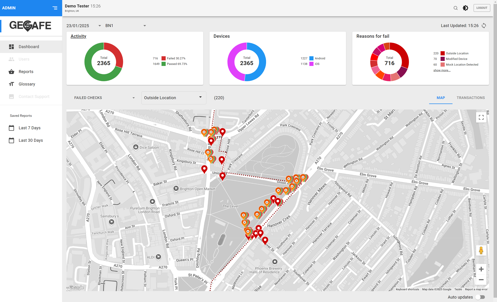
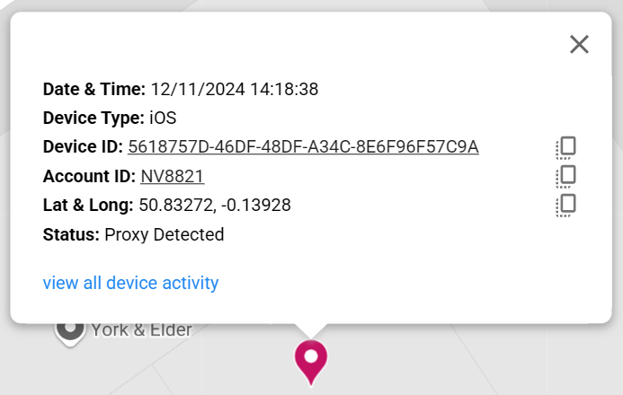
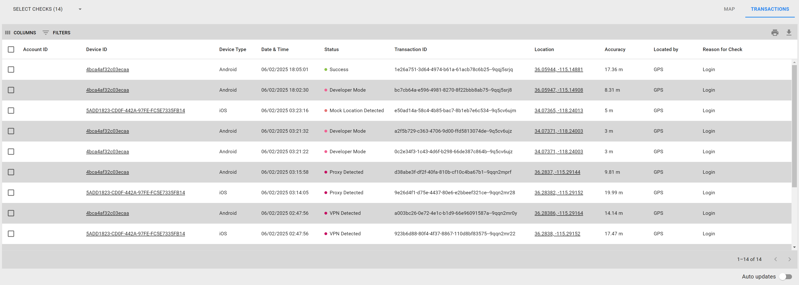
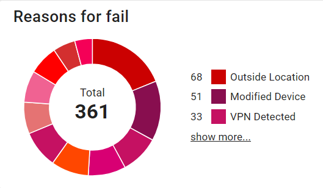

 
VERISON: 0.1 

## Overview 

### Portal Access 

#### Web Address 

The ACT-GeoSafe Admin Portal can be found at the following Address: 

https://sandbox.advancedcompliance.tech/login 

#### Login 

To Login to the Portal use the credentials sent to you via email – if you haven’t received an email please contact support@fantastic.tech 

## Dashboard 

### Map View 

The Admin Portal Dashboard lets you view lookup data geographically via a map – from this you can quickly spot any patterns/issues you may have with your customers validating their location. 

There are four sections to the Map View screen 

- **Map** 
This section details geographical representation of the lookups for the current day 
 
- **Activity** 
This section displays a pie chart showing the total number of lookups that have occurred on the selected date.  Lookups made inside the region are represented by green and the lookups that fail or are outside are represented by red. 

- **Devices** 
This section displays a pie chart showing the total number of lookups, split by device type, on the specified date. 

- **Top 3 reasons for fail** 
This chart shows the top three reasons for unsuccessful lookups and splits them up by the reason they failed – To view all the failures click on the Top 3 Reasons for Fail link 

Data Filters  

There are 3 filters that can be applied to the map, they are available on the top left of the map: 

## Lookup Reponses 
<table border="0">
  <tr>
    <td>
      
    </td>
    <td>&nbsp;&nbsp;&nbsp;&nbsp;</td>
    <td>
      <b>Inside location (Code 0)</b> 
          This is returned if the device requests a location from within the designated jurisdiction
    </td>
  </tr>

  <tr>
    <td>
      
    </td>
    <td>&nbsp;&nbsp;&nbsp;&nbsp;</td>
    <td>
      <b>Outside location (Code 3)</b> 
          This is returned by the middleware when it detects that the device is outside of location
    </td>
  </tr>
  
  <tr>
    <td>
      
    </td>
    <td>&nbsp;&nbsp;&nbsp;&nbsp;</td>
    <td>
      <b>Device not supported (Code 2)</b> 
          This is returned when the SDK detects that the device does not support GPS
    </td>
  </tr>
  
  <tr>
    <td>
      
    </td>
    <td>&nbsp;&nbsp;&nbsp;&nbsp;</td>
    <td>
      <b>Unknown location (Code 1)</b> 
          This is returned if the device requests a location check before the service has completely started and therefore, we do not have a current location for the device.
    </td>
  </tr>
  
  <tr>
    <td>
      
    </td>
    <td>&nbsp;&nbsp;&nbsp;&nbsp;</td>
    <td>
      <b>Location disabled (Code 5)</b> 
          This is returned when the SDK detects that the device has disabled its GPS
    </td>
  </tr>
  
  <tr>
    <td>
      
    </td>
    <td>&nbsp;&nbsp;&nbsp;&nbsp;</td>
    <td>
      <b>Modified device (Code 6)</b> 
          This is returned if the SDK detects that the device is jailbroken
    </td>
  </tr>
  
  <tr>
    <td>
      
    </td>
    <td>&nbsp;&nbsp;&nbsp;&nbsp;</td>
    <td>
      <b>Location Simulated by Software (Code 7)</b> 
          This is returned if the SDK detects that the location is simulated by software (i.e. FakeGPS)
    </td>
  </tr>
  
  <tr>
    <td>
      
    </td>
    <td>&nbsp;&nbsp;&nbsp;&nbsp;</td>
    <td>
      <b>Undetermined location (Code 8)</b> 
          Should never happen – occurs when we have bad config in the DB for that app and not able to determine if it is inside or not
    </td>
  </tr>
  
  <tr>
    <td>
      
    </td>
    <td>&nbsp;&nbsp;&nbsp;&nbsp;</td>
    <td>
      <b>Developer Mode (Code 9)</b> 
          This is returned if the SDK detects that device is running in developer mode
    </td>
  </tr>
  
  <tr>
    <td>
      
    </td>
    <td>&nbsp;&nbsp;&nbsp;&nbsp;</td>
    <td>
      <b>Device Blocked (Code 10)</b> 
          This is returned if the backend system finds this device on a blocked accounts list
    </td>
  </tr>
  
  <tr>
    <td>
      
    </td>
    <td>&nbsp;&nbsp;&nbsp;&nbsp;</td>
    <td>
      <b>Account Blocked (Code 11)</b> 
          This is returned if the backend system finds this account on a blocked accounts list
    </td>
  </tr>
  
  <tr>
    <td>
      
    </td>
    <td>&nbsp;&nbsp;&nbsp;&nbsp;</td>
    <td>
      <b>Global Blocked (Code 13)</b> 
          This is returned when the middleware detects that the Device is on the GeoSafe’s Global Blocked list, which means the device is blocked across all jurisdictions
    </td>
  </tr>
  
  <tr>
    <td>
      
    </td>
    <td>&nbsp;&nbsp;&nbsp;&nbsp;</td>
    <td>
      <b>Proxy Detected (Code 12)</b> 
          This is returned if the backend system finds determines that this device is running a VPN
    </td>
  </tr>
  
  <tr>
    <td>
      
    </td>
    <td>&nbsp;&nbsp;&nbsp;&nbsp;</td>
    <td>
      <b>VPN Detected (Code 14)</b> 
          This is returned if the backend system finds determines that this device is running a VPN
    </td>
  </tr>
  
  <tr>
    <td>
      
    </td>
    <td>&nbsp;&nbsp;&nbsp;&nbsp;</td>
    <td>
      <b>Emulator Detected (Code 15)</b> 
          This is returned if the backend system finds determines that this device is running a VPN
    </td>
  </tr>
  
  <tr>
    <td>
      
    </td>
    <td>&nbsp;&nbsp;&nbsp;&nbsp;</td>
    <td>
      <b>Invalid IP (Code 16)</b> 
          This is returned if the backend system finds determines that this device is running a VPN
    </td>
  </tr>
  
  <tr>
    <td>
      
    </td>
    <td>&nbsp;&nbsp;&nbsp;&nbsp;</td>
    <td>
      <b>Missing SessionId (Code 17)</b> 
          This is returned if the backend system finds determines that this device is running a VPN
    </td>
  </tr>
  
  <tr>
    <td>
      
    </td>
    <td>&nbsp;&nbsp;&nbsp;&nbsp;</td>
    <td>
      <b>Invalid SessionId (Code 18)</b> 
          This is returned if the backend system finds determines that this device is running a VPN
    </td>
  </tr>
  
  <tr>
    <td>
      
    </td>
    <td>&nbsp;&nbsp;&nbsp;&nbsp;</td>
    <td>
      <b>IP Not Matching (Code 19)</b> 
          This is returned if the backend system finds determines that this device is running a VPN
    </td>
  </tr>
  
  <tr>
    <td>
      
    </td>
    <td>&nbsp;&nbsp;&nbsp;&nbsp;</td>
    <td>
      <b>Expired SessionId (Code 20)</b> 
          This is returned if the backend system finds determines that this device is running a VPN
    </td>
  </tr>
  
  <tr>
    <td>
      
    </td>
    <td>&nbsp;&nbsp;&nbsp;&nbsp;</td>
    <td>
      <b>Version Not Supported (Code 21)</b> 
          This is returned if the backend system finds determines that this device is running a VPN
    </td>
  </tr>
    
  <tr>
    <td>
      
    </td>
    <td>&nbsp;&nbsp;&nbsp;&nbsp;</td>
    <td>
      <b>Other (Code 4)</b> 
         Any other reason other than these listed 
    </td>
  </tr>
</table>

## Pie Charts 

There are 3 different pie charts available on the main dashboard.  

 <table>
  <tr>
    <td>
      
    </td>
    <td>
      &nbsp;&nbsp;&nbsp;&nbsp;
    </td>
    <td>
      <b>Activity</b> 
      This chart shows the total number of lookups that have occurred for that region.  Lookups made inside the region are represented by green and the lookups outside are represented by red. 
    </td>
  </tr>
  <tr>
    <td>
      
    </td>
    <td>
      &nbsp;&nbsp;&nbsp;&nbsp;
    </td>
    <td>
      <b>Devices</b> 
      This chart shows the split of the lookups made by device type (iOS, Android and Web) for the selected region 
    </td>
  </tr>
  <tr>
    <td>
      
    </td>
    <td>
      &nbsp;&nbsp;&nbsp;&nbsp;
    </td>
    <td>
      <b>Top 3 Reasons for Fail</b> 
      This chart shows the proportion of unsuccessful lookups and splits them up by the reason they failed – to view all the reasons why the lookups failed click on the Top 3 Reasons for Fail link 
    </td>
  </tr>
</table>

<table>
  <tr>
    <td></td>
  </tr>
</table>

To view information on a specific transaction, click on the pin to open the above dialogue box.  The information displayed is listed below: 

- **Date & Time** 
Date and Time the Lookup occurred
 
- **Device ID** 
ID of the Device

- **Account ID** Customers Account ID
 
- **Transaction ID** Unique Lookup ID

- **Latitude & Longitude** Location details

- **Reason For Fail** Only available if the Lookup is either unsuccessful or outside.  This displays the reason that the lookup failed.

- **Reason For Lookup** This displays the reason that the Lookup occurred (for example customer was logging in or customer was placing a wager)

To go to the Device information page for this lookup click on the View all device activity link, this will show you all the details in the system for this device. 

## Transaction View

<table>
  <tr>
    <td></td>
  </tr>
</table>

Transaction view displays all the lookups matching the set filter. 

The data available in List View is as follows: 

- **Account ID** Customers Account ID, this is a link and if you click on it the Account information page opens detailing all the information about that account
 

- **Device ID** ID of the Device, this is a link and if you click on it the Device information page opens detailing all the information about that device
 

- **Date & Time** Date and Time the Lookup occurred
 

- **Lookup Result** This displays the result of the Lookup – either Success, or the reason that the lookup failed.
 

- **Transaction ID** Unique Lookup ID
 

- **Latitude & Longitude** Location details
 

- **Reason For Lookup** This displays the reason that the Lookup occurred (for example customer was logging in or customer was placing a wager)

You can further manipulate the data using the following features 

- **Columns** Use this feature to select which columns you wish to view.  When you click on this option you are presented with a list of all the columns with checkboxes next to them.  Use the checkbox to toggle on and off the column. 
 

 

- **Filters** Use the Filters feature to further filter the results.   When you click on this option you are presented with the following: 

Use the Columns selector to choose the column that you wish to filter further 
 
User the Operator dropdown to select how you want to filter the chosen column 
 
Finally type in the value that you wish to filter the chosen column by. 
 

- **Density** To change the height of the rows you can use the density feature: 
 
There are 3 different options: 

<table>
  <tr>
    <td>Compact</td>
    <td>Standard</td> 
    <td>Comfortable</td>
  </tr>
  <tr>
    <td></td>
    <td></td> 
    <td></td>
  </tr>
</table>

- **Export**
Use the Export feature to download the data as a Comma-Separated Variables (CSV) file or print them out 

When you hover your mouse over each column header, two buttons appear on it: 

 

- **Order / Sort** 

If you click on the arrow next to the title it will sort the date in the selected column – if the arrow is pointing down it will sort the data in ascending order, if the arrow is pointing up it will sort the data in descending order 
 

   

- **Feature menu** 

If you click on this button, it will open the feature menu.  This contains several options allowing you to manipulate the data in this column. 

- **Sort by ASC** This sorts the column by ascending 
 
- **Sort by DESC** This sorts the column by descending 
 
- **Filter** This opens the filter feature with the name of the column already filled in 
 
- **Hide column** This hides the selected column 
 
- **Manage columns** This opens the Columns feature and allows you to switch on and of the columns 

## Refresh (Auto) 

If you wish to update / refresh the data on the Dashboard, click the arrows on the top right of the data, next to the last updated time. 

You can turn on ‘Auto updates’ so that the data is always up to date.  This toggle is on the bottom right of the dashboard 

## Device Details 

### Summary screen 

There are four sections to the Device Details Summary screen 

- **Device Info** This section details information about the device 

- The operating system being used on the device 

- When the device was first seen on the ACT-Geosafe system 

- The ID of the device 

- The version of the ACT-Geosafe SDK installed on the device 
 

- **Activity** This section displays a pie chart showing the total number of lookups that have occurred on that device.  Lookups made inside the region are represented by green and the lookups outside are represented by red. 
 

- **Top 3 reasons for fail** This chart shows all the unsuccessful lookups and splits them up by the reason they failed 
 

- **Accounts used** This sections details information about all the Accounts that have used this device.  The information available is: 

- Customer (Account ID)** The Customer ID of the Account that performed the lookup – Use this link to go to the Account Details page for the selected account 
 

- Last seen When the account last performed a lookup 
 

- First seen When the account first performed a lookup 

- Last known location Last location that this account performed a lookup 
 

- Located by The technology mostly used to locate this account (GPS, cellular, Wi-Fi etc.) 
 

- Total activity Total number of lookups performed from this account 
 
- Status Status of the account 
 

Lookups 

 

The Lookups page shows all the lookups that occurred for the specified date range.   The date range is selected using the date selectors on the top left of the list: 

 

The default range is the current day 

The information available in the list view for each lookup is as follows: 

Customer (Account ID) 
The ID of the Account that performed the lookup 
 

Transaction Date 
The date and time the lookup occurred 
 

Status 
The result of the lookup – whether it was a success or failure and the reason for the failure 
 

Location 
The Latitude and Longitude of the device when the lookup was performed 
 

Located By 
This shows the technology that was used to find the devices location (WiFi, GPS, Cellular etc.) 
 

Transaction ID 

The unique ID for the transaction 

 

 

Locations 

 

The Locations page shows pins on the map for all the lookups that occurred for the specified date range.   The date range is selected using the date selectors on the top left of the list: 

 

The default range is the current day 

 

You can zoom in and out of the map using the + and – buttons on the bottom right of the map. 

 
To go to street view, drag and drop the yellow man icon to the chosen location 

 

Click on a PIN to get further details on that specific lookup 

 

 

Account Details 

Summary 

 

There are four sections to the Account Details Summary screen 

Account Info 
This section details information about the account 
 

When the account was first seen on the ACT-Geosafe system 

When the account was last seen on the ACT-Geosafe system 

The ID of the account 

The status of the account (active, blocked etc.) 
 

Activity 
This section displays a pie chart showing the total number of lookups that have occurred on that account.  Lookups made inside the region are represented by green and the lookups outside are represented by red. 
 

Top 3 reasons for fail 
This chart shows all the unsuccessful lookups and splits them up by the reason they failed 
 

Devices used 

This sections details information about all the Devices that have been used to perform lookups on this account.  The information available is: 

Device ID 
The Device ID of the device that performed the lookup – Use this link to go to the Device Details page for the selected device 
 
 

Last seen 
When the device last performed a lookup 
 

First seen 

When the device first performed a lookup 
 

Last known location 
Last location that this device performed a lookup 
 

Located by 
The technology mostly used to locate this device (GPS, cellular, Wi-Fi etc.) 
 

Total activity 
Total number of lookups performed from this device 
 

Status 
Status of the device 

 

 

Lookups 

 

The Lookups page shows all the lookups that occurred for the specified date range.   The date range is selected using the date selectors on the top left of the list: 

 

The default range is the current day 

The information available in the list view for each lookup is as follows: 

Device ID 
The ID of the Device that performed the lookup 
 

Transaction Date 
The date and time the lookup occurred 
 

Status 
The result of the lookup – whether it was a success or failure and the reason for the failure 
 

Location 
The Latitude and Longitude of the device when it performed the Lookup 
 

Located By 
This shows the technology that was used to find the devices location (WiFi, GPS, Cellular etc.) 
 

Transaction ID 

The unique ID for the transaction 

 

 

Locations 

The Locations page shows pins on the map for all the lookups that occurred for the specified date range.   The date range is selected using the date selectors on the top left of the list: 

 

The default range is the current day 

 

You can zoom in and out of the map using the + and – buttons on the bottom right of the map. 

 
To go to street view, drag and drop the yellow man icon to the chosen location 

 

Click on a PIN to get further details on that specific lookup 

 

 

 

 

 

 

Search 

There are two types of searches available, Basic and Advanced. 

Basic Search allows you to search by the following: 

Transaction ID 

Account ID 

Device ID 

Location co-ordinates (Latitude, Longitude) 

IP Address 

Advanced search also allows you to search by the following: 

Transaction Period 

Device Type 

Customers Located by 

Reason for failure 

 

Basic Search 

 

To use Basic search first select what you wish to search for by selecting the relevant option from the following dropdown:  

 

Once you select which option you wish to search for, use the text field to enter what you wish to search for. 

 

Advanced Search 

The advanced search allows you to further filter the query 

 

 

 

Transaction Period 

 

The Transaction Period allows you to search for lookups made in the previous week, month & 3 months – or you can define your own range using the Custom dates selector 

 

 

Device Type 

 

The Device Type section allows you to search for lookups made by a particular type of device for example iOS, Android etc 

 

Customers located by 

 

The Customers located by section allows you to search for lookups where the location was determined using a specific technology. The options available are listed below: 

 

 

Reason for failure
 
 

