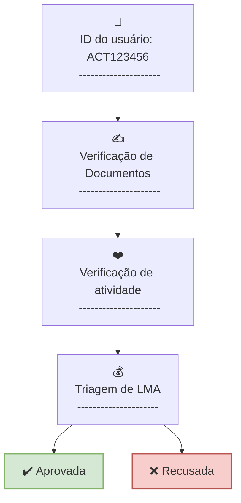

Version 1.1

### Líder da indústria
## Solução de verificação KYC

Desbloqueie a integração perfeita com nosso software de verificação KYC! Simplifique os processos de verificação de clientes, melhore a segurança e eleve a experiência do usuário sem esforço.  

#### Verificação de identidade 

Confie no **_Act ID_** para Serviços de Verificação de Identidade de primeira linha. Simplifique a autenticação, garanta a conformidade e promova interações seguras no seu cenário empresarial. 

#### Aumente a confiança e a segurança com um provedor KYC aprovado 

Nossos processos robustos de verificação atendem aos padrões e regulamentações do setor, garantindo segurança hermética. Simplifique a integração e ganhe confiança com nossas soluções KYC eficientes, confiáveis ​​e perfeitas. Junte-se ao futuro de interações seguras e confiáveis ​​com o cliente. 

#### Como funciona a verificação KYC 

**_Act Verify ID_** ajuda as empresas a atender aos requisitos de conformidade, como KYC e AML, sem a necessidade de investir recursos no desenvolvimento de seu próprio sistema KYC ou infraestrutura de armazenamento de dados. 

Por meio de nossas políticas precisas, você pode garantir a privacidade e a segurança dos dados dos seus usuários, ao mesmo tempo em que simplifica o processo de inscrição em todas as plataformas. 

Nossa missão é impulsionar negócios por meio da verificação contínua da identidade do cliente e do armazenamento seguro de dados criptografados, dando aos indivíduos melhor controle sobre seus dados pessoais. 

- **Etapa 1.** O processo KYC começa com a coleta de informações cruciais do cliente, como nome completo, data de nascimento, endereço e outros detalhes relevantes 
 

- **Etapa 2.** Após coletar as informações do cliente, os dados são processados ​​e a identidade do cliente é cuidadosamente verificada para garantir precisão e legitimidade. 
 

- **Etapa 3.** Após a verificação inicial, o monitoramento contínuo da expiração dos documentos e de suas aparições em bancos de dados é crucial para a conformidade e a detecção de atividades suspeitas. 

#### Serviços automatizados de verificação de identidade 

Experimente uma verificação rápida, precisa e orientada à conformidade com tecnologia de ponta, garantindo que sua empresa opere com a confiança e a eficiência que merece. Abrace o futuro da verificação de identidade hoje para aprimorar a experiência do usuário e proteger-se contra fraudes.

#### Verificação de ID Swift 

O processo de verificação de ID envolve integração perfeita ao seu fluxo de trabalho. Os usuários enviam seus documentos de identidade, e nossa tecnologia avançada realiza verificações em tempo real, garantindo precisão e conformidade.

- **Qualidade😎** Acesse resultados superiores com nosso sistema de conformidade proprietário e profissionais jurídicos dedicados. Alcance seus objetivos com confiança e sem concessões. 
 

- **Segurança👮** Garantir a adesão aos mais rigorosos padrões de segurança por meio do nosso compromisso com a conformidade rigorosa, validado por certificados ISO e auditorias de segurança.
 

- **Velocidade🚀** Habilite a verificação imediata de documentos e selfies, além do mais alto SLA do setor para verificações manuais.

#### Procedimento de verificação de identidade confiável 

Procedimento abrangente confiável integra tecnologia de ponta e verificações meticulosas. Começando pelo envio de documentos, os usuários recebem a melhor experiência e jornada perfeita, garantindo precisão, conformidade e segurança em cada etapa.

- **Envio de documentos** A etapa inicial do processo de verificação é o envio do documento de identificação, que é simplificado pelas opções de upload ou tirar uma foto dos documentos do usuário. Nenhuma entrada manual de dados é necessária do requerente.
 

- **Extração de dados** A tecnologia OCR com tecnologia de IA extrai prontamente todos os pontos de dados necessários do documento fornecido, como nome, sobrenome, data de nascimento, etc. Ela garante precisão e eficiência na captura e validação de detalhes cruciais, garantindo uma experiência de verificação mais suave para cada participante.
 

- **Autenticação biométrica (opcional)** Opte pela autenticação biométrica para maior segurança e confiança. Ela confirma a presença ativa do candidato e combate ataques de falsificação. A tecnologia original de IA combina características biométricas com documentos de identificação durante nossa verificação simples de Liveness e Selfie
 

- **Verificações de banco de dados** Nosso sistema completo faz a comparação cruzada dos dados dos candidatos com bancos de dados globais e locais (consulte o apêndice I), incluindo PEP, sanções e listas de observação, juntamente com listas negras personalizadas. Isso garante a conformidade, protegendo seus interesses e atendendo aos exigentes padrões regulatórios
 

- **Verificação em Tempo Real** Nossas verificações rápidas e precisas fornecem resultados quase instantâneos, garantindo uma experiência de verificação segura e rápida. Assim que o candidato conclui todas as etapas, o perfil de verificação aparece no painel da conta e envia uma notificação ao usuário, seguida pelo retorno de chamada com todos os status e dados

#### Documentos suportados para um processo de verificação de identidade robusto 

Eleve sua experiência de verificação de identidade com o amplo suporte de documentos da KYCAID.
Confiança na verificação de identidade, um documento de cada vez

**Documentos de identificação:**

- Passaporte 
- Passaporte nacional 
- Cartão de identificação 
- Cartas de Condução 
- Cartão de residência permanente 

**Documentos financeiros:**

- Cartão bancário 
- Extratos bancários

**Identificação Fiscal e Financeira:**

- Número de identificação fiscal 
- Declarações de impostos 

**Verificação Residencial e de Endereço:**

- Conta de serviços públicos de água, gás, eletricidade, telefone ou internet (não celular) 
- Extrato bancário com endereço, data e nome
- Contrato de locação 
- Contrato de locação assinado 
- Acordo de hipoteca 
- Qualquer correspondência emitida por autoridades governamentais 
- Declarações de impostos 

**Apêndice I**

O sistema ACT Verify verifica os seguintes dados relevantes para o mercado brasileiro: 

- INTERPOL Red Notices 
- United Nations Security Council Consolidated List 
- Global PEP List 
- Office of Foreign Assets Control (OFAC) 
- FBI Most Wanted 
- EU Financial Sanctions Files (FSF) 
- UK OFSI Consolidated List of Targets 
- Swiss SECO Sanctions/Embargoes 
- Canadian Special Economic Measures Act Sanctions 
- EU Consolidated Travel Bans 
- Australian Sanctions Consolidated List 
- UN Security Council Consolidated Sanctions 
- Rosfinmonitoring WMD-related entities 
- Russian Oligarch Database 
- Global PEP Lists (e.g., Wikidata PEPs, Wikidata Entities of Interest) 

We also check the data in the databases below, including but not limited to them:  

- CIA world leaders  
- FBI  
- Denied Persons List with Denied US Export Privileges  
- United States Drug Enforcement Administration  
- Bureau of Industry and Security  
- Europol  
- European Securities and Markets Authority  
- Every Politician  
- National Settlement Depository (NSD Russia) ISIN Assignment  
- US Trade Consolidated Screening List (CSL)  
- Ukraine NABC Sanctions Tracker  
- PEP Public Database of PEPs in Russia and Belarus  
- OCC Enforcement Actions  
- ACF List of bribe-takers and warmongers  
- Ukraine National Security Sanctions  
- Belgian Financial Sanctions  
- French Freezing of Assets  
- Japan Economic sanctions and list of eligible people  
- Kazakh Terror Financing list  
- New Zealand Russia Sanctions  
- WorldBank Debarred Providers  
- Kyrgyz National List  
- African Development Bank Debarred Entities  
- Asian Development Bank Sanctions  
- UK Companies House Disqualified Directors  
- Inter-American Development Bank Sanctions  
- Ukraine SFMS Blacklist  
- Israel Terrorists Organizations and Unauthorized Associations lists  
- Members of the European Parliament  
- Members of the European Committee of the Regions  
- Bulgarian Persons of Interest  
- Argentine RePET  
- US BIS Denied Persons List  
- UNOPS Vendor Sanctions  
- South African Targeted Financial Sanctions  
- Azerbaijan Domestic List  
- Dutch National Sanction list Terrorism  
- Forbes 2021 List of Russian Billionaires  
- EU Sanctions Map  
- Europe's most wanted fugitives  
- Polish list of persons and entities subject to sanctions  
- Canadian Listed Terrorist Entities  
- Singapore Targeted Financial Sanctions  
- FBK Recommended List of Individuals for Sanctioning (Navalny 35)  
- NCA Most Wanted  
- EBRD Ineligible entities 
