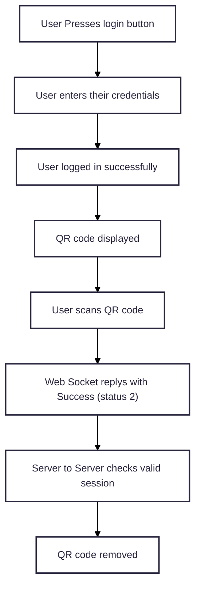

## Overview

Recommended user flow:

### Geolocation Integration Overview
Our geolocation solution ensures that customers can only access your services from approved jurisdictions. This is achieved through a simple flow that begins with integrating our SDK and ends with verifying that the customer is in the right place — without exposing sensitive data or interrupting their experience.

#### Step 1: Install the SDK
The first step is to integrate our SDK into your application. This SDK handles the communication with our geolocation service and ensures that checks are performed securely and accurately.

#### Step 2: Initialize the SDK
Once installed, the SDK needs to be configured with three key pieces of information:

- Your API Key
- Your Account ID
- The base URL of our service

##### Returns:
- A promise that resolves to the server’s sdk initialization response, usually a JSON object containing sdk initialization information.
- The Response contains the following:
  - An api response indicating the status (0 for success).
  - The sessionId, a unique identifier for the session.
  - The session expiry time in timestamp format.
  - A Base64 image data of qr code.

This setup tells the SDK which jurisdiction to validate the customer against.

#### Step 3: Present the QR Code
After the SDK is ready, your application can present a QR code to the customer. Once the customer scans the code, this begins the geolocation process, allowing the customer to share their location securely through their mobile device.

#### Step 4: Start the Location Validation
At this point, the SDK checks whether it can start the customer’s session. A successful start means the location request is active and we’re waiting for the customer’s location to be verified.

The SDK tracks the session’s status:

- Pending – Waiting for the customer to complete the process.
- Success – Customer location validated and in the correct jurisdiction.
- Failure/Expired – Something went wrong or the session timed out.
- Missing Info – For example, if a session ID is not present or valid.

#### Step 5: Server-to-Server Validation
Once the session is active, your backend system can call our service to double-check the customer’s validation status. This server-to-server confirmation ensures the customer has been successfully located and meets regulatory requirements.

#### Step 6: End the Session (if needed)
If you ever need to manually end the customer’s geolocation session — for example, if they abandon the process or log out — you can tell the SDK to stop the session.

#### Summary Flow
- Install and configure the SDK.
- Present the QR code to the customer.
- Start the geolocation check.
- Confirm the result from your backend.
- End the session if necessary.

This process helps ensure compliance, reduce fraud, and give your customers a smooth, secure experience.

#### Initialise 

The first call to the SDK is the Initialization call.  This requires an API Key to identify who you are and what Jurisdiction you are licensed to. 

The customer downloads the ACT Verify app to their mobile device.  Once installed they must scan a QR code to initialise the SDK – The QR code is generated by ACT Verify and displayed on your website. 

#### Start / Stop location service 

After successfully initializing the SDK with a QR Code, use this method to start a validation timer. This timer checks whether the user has validated their location by scanning the QR code using the ACT Verify App within the server-specified timeout. 

The customer can use the Extend Session button to restart the clock so that the Session Expires Time does not run out.  Every time the customer extends their session their location is checked again. 

